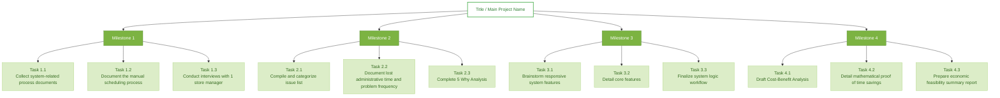

```mermaid
graph TD
    A[Title / Main Project Name] --> B[Milestone 1]
    A --> C[Milestone 2]
    A --> D[Milestone 3]
    A --> E[Milestone 4]


    B --> B1[Task 1.1
Collect system-related process documents ]
    B --> B2[Task 1.2
Document the manual scheduling process]
    B --> B3[Task 1.3
Conduct interviews with 1 store manager]

    C --> C1[Task 2.1
Compile and categorize issue list]
    C --> C2[Task 2.2
Document lost administrative time and problem frequency]
    C --> C3[Task 2.3
Complete 5 Why Analysis]

    D --> D1[Task 3.1
Brainstorm responsive system features]
    D --> D2[Task 3.2
Detail core features]
    D --> D3[Task 3.3
Finalize system logic workflow]

    E --> E1[Task 4.1
Draft Cost-Benefit Analysis]
    E --> E2[Task 4.2
Detail mathematical proof of time savings]
    E --> E3[Task 4.3
Prepare economic feasibility summary report]
    
    style A fill:#ffffff,stroke:#4CAF50,stroke-width:2px,color:#2e7d32
    style B fill:#7CB342,stroke:#558b2f,color:#ffffff
    style C fill:#7CB342,stroke:#558b2f,color:#ffffff
    style D fill:#7CB342,stroke:#558b2f,color:#ffffff
    style E fill:#7CB342,stroke:#558b2f,color:#ffffff
    style B1 fill:#dcedc8,stroke:#aed581,color:#33691e
    style B2 fill:#dcedc8,stroke:#aed581,color:#33691e
    style B3 fill:#dcedc8,stroke:#aed581,color:#33691e
    style C1 fill:#dcedc8,stroke:#aed581,color:#33691e
    style C2 fill:#dcedc8,stroke:#aed581,color:#33691e
    style C3 fill:#dcedc8,stroke:#aed581,color:#33691e
    style D1 fill:#dcedc8,stroke:#aed581,color:#33691e
    style D2 fill:#dcedc8,stroke:#aed581,color:#33691e
    style D3 fill:#dcedc8,stroke:#aed581,color:#33691e
    style E1 fill:#dcedc8,stroke:#aed581,color:#33691e
    style E2 fill:#dcedc8,stroke:#aed581,color:#33691e
    style E3 fill:#dcedc8,stroke:#aed581,color:#33691e
```
