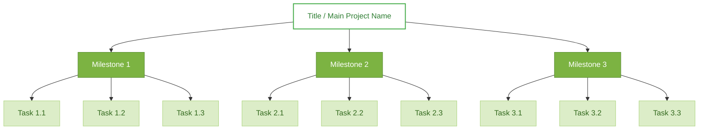

```mermaid
graph TD
    A[Title / Main Project Name] --> B[Milestone 1]
    A --> C[Milestone 2]
    A --> D[Milestone 3]

    B --> B1[Task 1.1]
    B --> B2[Task 1.2]
    B --> B3[Task 1.3]

    C --> C1[Task 2.1]
    C --> C2[Task 2.2]
    C --> C3[Task 2.3]

    D --> D1[Task 3.1]
    D --> D2[Task 3.2]
    D --> D3[Task 3.3]
    
    style A fill:#ffffff,stroke:#4CAF50,stroke-width:2px,color:#2e7d32
    style B fill:#7CB342,stroke:#558b2f,color:#ffffff
    style C fill:#7CB342,stroke:#558b2f,color:#ffffff
    style D fill:#7CB342,stroke:#558b2f,color:#ffffff
    style B1 fill:#dcedc8,stroke:#aed581,color:#33691e
    style B2 fill:#dcedc8,stroke:#aed581,color:#33691e
    style B3 fill:#dcedc8,stroke:#aed581,color:#33691e
    style C1 fill:#dcedc8,stroke:#aed581,color:#33691e
    style C2 fill:#dcedc8,stroke:#aed581,color:#33691e
    style C3 fill:#dcedc8,stroke:#aed581,color:#33691e
    style D1 fill:#dcedc8,stroke:#aed581,color:#33691e
    style D2 fill:#dcedc8,stroke:#aed581,color:#33691e
    style D3 fill:#dcedc8,stroke:#aed581,color:#33691e
```
